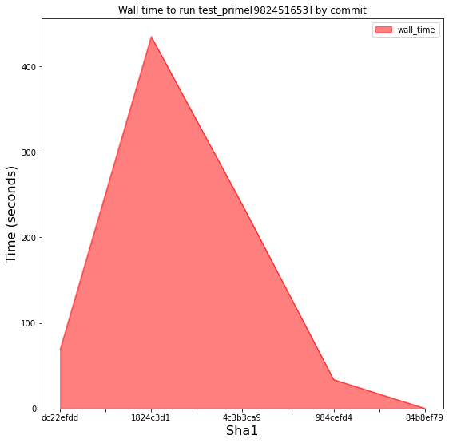

### Monitor your Python tests to optimise your code!

Jean-Sébastien Dieu, Architect @ [CFM](https://www.cfm.fr)

jean-sebastien.dieu@cfm.fr

--- ---

##### Context

Let's consider a resource critical function whose job is to check a number primality.

##### Questions <!-- .element: class="fragment" data-fragment-index="1" -->

* How do we monitor the resource consumption? <!-- .element: class="fragment" data-fragment-index="1" -->
* How do we compare resource usage between runs? <!-- .element: class="fragment" data-fragment-index="2" -->
* How can we anticipate our CI machine capacity?  <!-- .element: class="fragment" data-fragment-index="3" -->
* If we rely on a third party, how can we check its updates? <!-- .element: class="fragment" data-fragment-index="4" -->

---
 ## Pytest-monitor
---

##### About 

* Pytest plugin <!-- .element: class="fragment" data-fragment-index="1" data-autoslide="1000" -->
* Few requirements needed <!-- .element: class="fragment" data-fragment-index="2" data-autoslide="1000" -->
* Small overhead  <!-- .element: class="fragment" data-fragment-index="3" data-autoslide="1000" -->
* Track resources consumed by any test suite <!-- .element: class="fragment" data-fragment-index="4" data-autoslide="1000" -->
    * Memory
    * Compute time (cpu, user, wall)
    * CPU usage
* Historize the results <!-- .element: class="fragment" data-fragment-index="5" -->

---
With pytest, our test might look like:

```python [1-6]
import pytest
from my_package import is_prime


@pytest.mark.parametrize('n', [2, 3, 997, 104743, 982451653])
def test_prime(n):
    assert is_prime(n)
```
---

##### Results

```
bash $> pytest --tag demo=yes --tag talk=ospo

======================== test session starts ========================
platform linux -- Python 3.6.8, pytest-4.4.1, py-1.8.0, pluggy-0.11.0
rootdir: /home/jdieu/projects/ospoxp/pytest-monitor
plugins: monitor-1.6.2
collected 5 items
test/test_primality.py .....                              [ 100%]

======================= 5 passed 20.13 seconds ======================
```
---

##### Fetch data
 TODO change data
```sql
sqlite> select ITEM, TOTAL_TIME, CPU_USAGE, MEM_USAGE, ITEM_PATH from TEST_METRICS;
test_sleep1|1.00518894195557|0.0|0.76953125|pkg1.test_mod1
test_heavy|0.00533604621887207|0.0|0.80078125|pkg1.test_mod1
test_heavy|0.00467038154602051|2.14115268773291|0.8125|pkg1.test_mod1
test_heavy|0.00461006164550781|0.0|1.26953125|pkg1.test_mod1
test_heavy|0.0324029922485352|0.925840421461576|1.51953125|pkg1.test_mod1
test_sleep_400ms|0.405560970306396|0.0246572050373711|1.51953125|pkg1.test_mod2
test_master_sleep|5.00535321235657|0.998930502578049|1.51953125|pkg2.test_mod_a
test_method1|0.506380081176758|0.0|1.51953125|pkg3.test_mod_cl
test_force_monitor|5.0064685344696|0.998707964621156|1.51953125|pkg4.test_mod_a
```

--- ---
 ## Monitor-server-API
---
##### About

Leverage pytest-monitor with 2 building blocks:

 - API (Python)
   * dedicated to query and fetch your data
   * works seemlessly with a local pytest-monitor database
---
##### About

Leverage pytest-monitor with 2 building blocks:

 - Server (REST)
   * manage a dedicated storage (through REST API) to insert metrics
   * enable parallelism in your test session (xdist support)

---

##### Full integration

```
bash $> pytest --remote $URL --tag demo=yes --tag talk=ospo

======================== test session starts ========================
platform linux -- Python 3.6.8, pytest-4.4.1, py-1.8.0, pluggy-0.11.0
rootdir: /home/jdieu/projects/perso/pytest-monitor
plugins: monitor-1.6.2
collected 5 items
test/test_primality.py .....                              [ 100%]

======================= 5 passed 20.13 seconds ======================
```

---

##### Example, fetching data with the API


```python
from monitor_server_api import Monitor, Field

mon = Monitor('http://my-monitor-server.org/api/v1')
sessions = mon.list_sessions()
metrics = mon.list_metrics_from(sessions)
df = metrics.to_df(sessions,
                   keep=[Field.ITEM_VARIANT, Field.TOTAL_TIME,
                         Field.ITEM_START_TIME, Field.MEM_USAGE,
                         Field.SCM])

```
---
<style>.container{
    display: flex;
}
.col{
    flex: 1;
}
</style>
<div class="container">
  <div class="col">
    
  </div>
  <div class="col">
    
  </div>
</div>

---

##### conclusion

* Easy to fetch and plot data
* No need to worry about internal data model
* Enables parallelism
* Perfect companion to pytest-monitor :)

--- ---

# Use Cases

---

### Know your dependencies

 - Migrating a dependencies (e.g.: pandas) can lead to
   - behavioral change
   - performance degradation on your core features
 
 - Tracking your application’s resource footprint can
   - prevent unwanted resource consumption
   - help you validate your requirements's version

---

### Know your tests

 - Applying load to a system can harm the performances
 - Analyzing resources can 
    - provide comprehensive view of tests and their category
    - help determining problems
    - validate new dev

--- ---
### Questions?
--- ---
### Addendum
---
##### Data Model

```
                  ┌─────────────────┐
                  │                 │
        ┌─────────┤  Test Metrics   ├───────┐
        │         │                 │       │
        │         └─────────────────┘       │
        │                                   │
        │                                   │
┌───────▼─────────┐                ┌────────▼───────┐
│                 │                │                │
│  Sessions Info  │                │  Machine Info  │
│                 │                │                │
└─────────────────┘                └────────────────┘
```


                     
---
