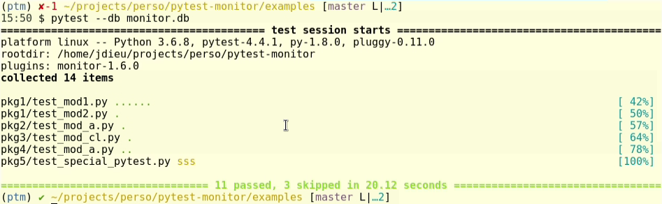

### Monitor your Python tests to optimise your code!

Jean-Sébastien Dieu, Architect @ [CFM](https://www.cfm.fr)

jean-sebastien.dieu@cfm.fr

--- ---

##### Context

Let's consider a resource critical function whose job is to check a number primality.

##### Questions <!-- .element: class="fragment" data-fragment-index="1" -->

* How do we monitor the resource consumption? <!-- .element: class="fragment" data-fragment-index="1" -->
* How do we compare resource usage between runs? <!-- .element: class="fragment" data-fragment-index="2" -->
* How can we anticipate our CI machine capacity?  <!-- .element: class="fragment" data-fragment-index="3" -->
* If we rely on a third party, how can we check its updates? <!-- .element: class="fragment" data-fragment-index="4" -->

---
 ## Pytest-monitor
---

##### About 

* Pytest plugin <!-- .element: class="fragment" data-fragment-index="1" data-autoslide="1000" -->
* Few requirements needed (sqlite3, python, memory_profiler and psutils) <!-- .element: class="fragment" data-fragment-index="2" data-autoslide="1000" -->
* Small footprint (very little overhead, perfectly acceptable for large scale run)  <!-- .element: class="fragment" data-fragment-index="3" data-autoslide="1000" -->
* Track resources consumed by any test suite <!-- .element: class="fragment" data-fragment-index="4" data-autoslide="1000" -->
    * Memory
    * Compute time
    * etc.
* Historize the results <!-- .element: class="fragment" data-fragment-index="5" -->

---
With pytest, a possible test would be:

```python [1-6]
import pytest
from my_package import is_prime

@pytest.mark.parametrize('n', [2, 3, 997, 104743, 982451653])
def test_prime(n):
    assert is_prime(n)
```

---

##### Results



---

##### Fetch data

```sql
sqlite> select ITEM, TOTAL_TIME, CPU_USAGE, MEM_USAGE, ITEM_PATH from TEST_METRICS;
test_sleep1|1.00518894195557|0.0|0.76953125|pkg1.test_mod1
test_heavy|0.00533604621887207|0.0|0.80078125|pkg1.test_mod1
test_heavy|0.00467038154602051|2.14115268773291|0.8125|pkg1.test_mod1
test_heavy|0.00461006164550781|0.0|1.26953125|pkg1.test_mod1
test_heavy|0.0324029922485352|0.925840421461576|1.51953125|pkg1.test_mod1
test_sleep_400ms|0.405560970306396|0.0246572050373711|1.51953125|pkg1.test_mod2
test_master_sleep|5.00535321235657|0.998930502578049|1.51953125|pkg2.test_mod_a
test_method1|0.506380081176758|0.0|1.51953125|pkg3.test_mod_cl
test_force_monitor|5.0064685344696|0.998707964621156|1.51953125|pkg4.test_mod_a
```

--- ---
 ## Monitor-server-API
---
### About

Leverage pytest-monitor:

 - dedicated Python API to query and fetch your data
 - dedicated storage (through REST API), but works seemlessly with a local pytest-monitor database.
 - enable parallelism in your test session.

---

### Introduction

The package is split in 2 components:
 * The REST server for storing and fetching data (flask + uwsgi + SQLite or PostGreSQL)
 * The API designed to easily query and filter data either from either (requests + Pandas)
<!-- Coucou .element: class="fragment" data-fragment-index="2" -->
<!-- ReCoucou .element: class="fragment" data-fragment-index="1" -->

---

### Example: sending data

```bash
bash $> pytest --remote http://my-monitor-server.org/api/v1 --tag demo=yes

=============================================================================================== test session starts ===============================================================================================
platform linux -- Python 3.6.8, pytest-4.4.1, py-1.8.0, pluggy-0.11.0
rootdir: /home/jdieu/projects/perso/pytest-monitor
plugins: monitor-1.6.0
collected 14 items                                                                                                                                                                                                
pkg1/test_mod1.py ......         [ 42%]
pkg1/test_mod2.py .              [ 50%]
pkg2/test_mod_a.py .             [ 57%]
pkg3/test_mod_cl.py .            [ 64%]
pkg4/test_mod_a.py ..            [ 78%]
pkg5/test_special_pytest.py sss  [100%]

====================================================================================== 11 passed, 3 skipped in 20.13 seconds ======================================================================================
```

---

### Example, fetching data


```python
from monitor_server_api import Monitor

mon = Monitor('http://my-monitor-server.org/api/v1')
sessions = mon.list_sessions()
df = sessions.to_df()

```
---
<style>.container{
    display: flex;
}
.col{
    flex: 1;
}
</style>
<div class="container">
  <div class="col">
    
  </div>
  <div class="col">
    
  </div>
</div>

---

### conclusion

Easy to use
easier to fetch and plot data
Ideal companion to pytest-monitor :)

--- ---

# Use Cases

---

### Know your dependencies

---

### Know your tests

--- ---
### Questions?
--- ---
### Addendum
---
##### Data Model

```
                  ┌─────────────────┐
                  │                 │
        ┌─────────┤  Test Metrics   ├───────┐
        │         │                 │       │
        │         └─────────────────┘       │
        │                                   │
        │                                   │
┌───────▼─────────┐                ┌────────▼───────┐
│                 │                │                │
│  Sessions Info  │                │  Machine Info  │
│                 │                │                │
└─────────────────┘                └────────────────┘
```


                     
---
